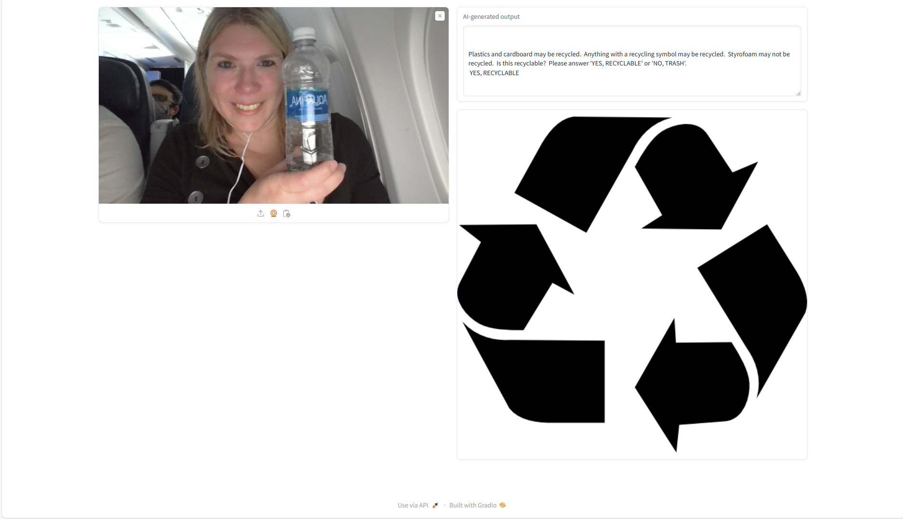
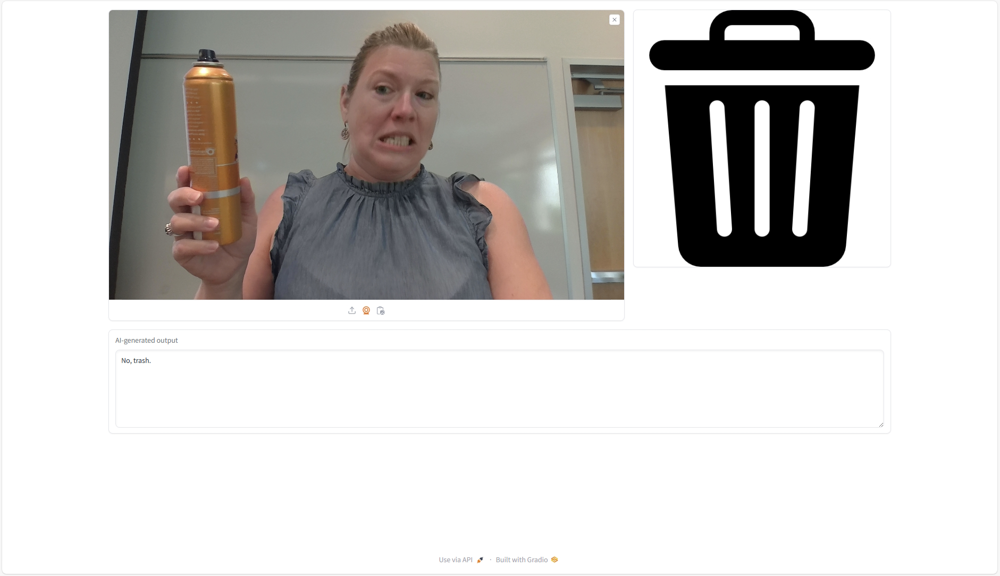

# Phi Recycling
New scenario unlocked with Phi vision model to sort trash and recycling at scale

## Overview 
The Phi family of models shows the power of small language models.  In this demonstration, we will be using Phi 3 with vision specifically.  

As small language models (SLM) are obviously smaller, the quality of image understanding may not be quite as good as with a large language model, but there are some advantages:
+ SLMs allow local execution, which is valuable for a number of reasons - lack of connectivity, latency constraints, or sharing-data-to-the-cloud concerns
+ SLMs allow you to call the model at great scale

A new scenario that small language models like Phi could unlock is **sorting trash and recycling**.  Misplacing trash into recycling bins has major financial and environmental impact.  When trash is mixed in with recyclables, it can contaminate the entire batch, which often means that the contaminated recyclables cannot be processed and end up in landfills instead.  This contributes to the growing amount of waste in landfills and exacerbates issues like soil and water pollution as well as greenhouse gas emissions from decomposing waste.  If recycling facilities have to spend additional time and resources to sort out contaminants, this increases the overall cost of recycling and makes the process less efficient.  For more information, see:
+ https://www.epa.gov/recycle/frequent-questions-recycling
+ https://www.earthday.org/how-our-trash-impacts-the-environment/
+ https://sustainabity.com/en/why-garbage-separation-matters-environmental-impact-and-benefits/

Let's imagine a public park with trash and recycling bins as an example.  An image understanding model like Phi 3 with vision could decide if an item held up to a camera was trash or recyclable, so it could be disposed of properly.  The prompt could be easily modified for local recycling guidelines.  Phi 3 can handle the enormous scale of many people throwing things away, and it could run locally without the need for network connectivity in an outdoor space.  The relative cost of a large language model in the cloud plus its connectivity requirements may not make this feasible for large language models, but this is a scenario that becomes possible with a model like Phi.  

## Demo Experience
On the left side of the screen is an image placeholder.  Using the three small icons below it, you can upload a saved image, use your camera to take a picture, or paste an image from your clipboard.  After selecting an image, the model will run and determine if the item in the image is recyclable or not.  This output will be shown visually on the right side of the screen.  If it is recyclable, it will show a recycle symbol.  If it is non-recyclable, it will show a trash bin symbol.  

This is an early version of the application, proving that it runs locally with no internet connectivity on an airplane.  


Here is the experience when the item cannot be recycled, like an aerosol can of hairspray.  


## Setup

### First run
```
conda create --name recycling python=3.10 -y
conda activate recycling

pip install -r requirements.txt
python recycling.py
```

### Subsequent runs
```
conda activate recycling
python recycling.py
```
